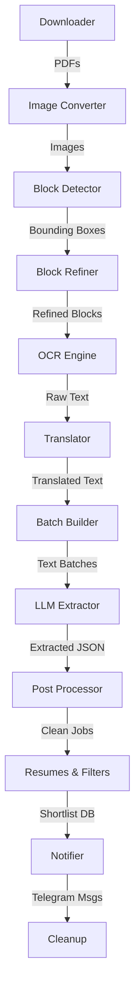
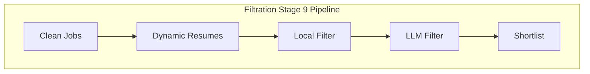

# Smart Job Scanner v2 — Portfolio Summary
## 1. What this is
Smart Job Scanner v2 is an automated OCR and ETL pipeline that extracts, processes, and curates job postings from newspaper PDFs into a structured format. It serves users by monitoring numerous local and national newspaper editions daily, using local machine learning models (EasyOCR, OpenHermes via Ollama) to reliably identify and translate relevant job opportunities. The project is non-trivial as it orchestrates a robust 14-stage workflow combining hardware-accelerated computer vision, resilient checkpointing, and natural language extraction to push highly filtered alerts directly to a Telegram channel.

## 2. Honest status
- **Working:** The orchestration shell script successfully coordinates 14 pipeline stages, handling execution, logging, and metrics. (`scripts/run_pipeline.sh:58-73`)
- **Working:** PDF to image conversion, block detection, and OCR with EasyOCR are fully implemented. (`src/pipeline/stage04_ocr.py:12`)
- **Working:** The LLM extraction module is robust, featuring token-adaptive windowing, concurrent batch processing, and SQLite-based state tracking. (`src/pipeline/stage07_llm_extraction.py:59-66`)
- **Working:** Telegram notifications are actively sending parsed updates, utilizing SQLite history to prevent duplicates. (`src/pipeline/stage10_notification.py:44-59`)
- **Partial/Stubbed:** The local filtration and resume-matching systems have scripts in place but rely on hardcoded keyword limits or specific prompt logic which may be incomplete or tuning-dependent. (`src/pipeline/stage09_local_filter.py`, `src/pipeline/stage09_llm_filter.py`)

## 3. Architecture
| Component | Role | Key File |
| --- | --- | --- |
| Downloader | Retrieves newspaper PDFs from scheduled sources | `src/downloader/newspaper_downloader.py` |
| Image Converter | Transforms PDF pages into processable image files | `src/pipeline/stage01_pdf_to_images.py` |
| Block Detector | Identifies text bounding boxes on images | `src/pipeline/stage02_block_detection.py` |
| Block Refiner | Adjusts and filters detected text blocks | `src/pipeline/stage03_block_refiner.py` |
| OCR Engine | Reads text from blocks using EasyOCR on GPU | `src/pipeline/stage04_ocr.py` |
| Translator | Translates non-English text to target language | `src/pipeline/stage05_translation.py` |
| Batch Builder | Groups translated text into LLM context chunks | `src/pipeline/stage06_batch_builder.py` |
| LLM Extractor | Parses structured jobs from text using Ollama | `src/pipeline/stage07_llm_extraction.py` |
| Post Processor | Cleans and normalizes LLM outputs | `src/pipeline/stage08_post_processing.py` |
| Resume Engine | Dynamic resume matching logic | `src/pipeline/stage09_dynamic_resumes.py` |
| Local Filter | Keyword-based basic filtering | `src/pipeline/stage09_local_filter.py` |
| LLM Filter | Semantic LLM-based filtering | `src/pipeline/stage09_llm_filter.py` |
| Shortlister | Compiles the final list of valid job postings | `src/pipeline/stage09_shortlist.py` |
| Notifier | Formats and sends HTML notifications to Telegram | `src/pipeline/stage10_notification.py` |
| Cleanup | Purges temporary data and maintains storage | `src/pipeline/stage11_cleanup.py` |

## 4. Workflow graph (the important one)

## 5. Tech stack (proven)
- **Python**: Core language used for all stages (`scripts/run_pipeline.sh:40`)
- **EasyOCR**: Local optical character recognition library (`src/pipeline/stage04_ocr.py:12`)
- **PyTorch**: Deep learning framework backing OCR and models (`requirements.txt:27`)
- **Ollama**: Local LLM runner used for OpenHermes data extraction (`src/pipeline/stage07_llm_extraction.py:12`)
- **SQLite3**: Lightweight database for state and shortlist history (`src/pipeline/stage10_notification.py:8`)
- **Bash**: Shell scripting for pipeline orchestration (`scripts/run_pipeline.sh:1`)

## 6. True numbers
- **14** — Distinct sequentially executed pipeline stages — `scripts/run_pipeline.sh:58-73`
- **3800** — Megabytes set as GPU memory limit for EasyOCR — `src/pipeline/stage04_ocr.py:54`
- **12** — Web sources configured for direct newspaper PDF downloads — `configs/newspaper_config.json:3-62`
- **5** — Maximum retries allowed for a failing pipeline stage — `scripts/run_pipeline.sh:56`

## 7. Visual opportunities
- **Terminal UI**: The pipeline uses the `rich` library to draw a progress spinner and status bars during the LLM extraction which would make an excellent dynamic screenshot (`python src/pipeline/stage07_llm_extraction.py --debug`).
- **Workflow Graph**: The 14-stage Mermaid graph accurately models a complex, real-world ETL pipeline, suitable for a README header.
- **Telegram Channel**: The actual formatted HTML alerts generated by the Notification stage could be screenshotted to show the end-product output.

## 8. Redaction warnings
- `.env`
- `configs/gemini_config.json`
- `configs/newspaper_config.json`
- `token_telegram/`

## 9. Coverage note
I did not read `node_modules`, `venv/.venv`, `.git`, datasets, model weights, or media files as instructed. Additionally, to prioritize the core source code, I skipped `runs`, `logs`, `history`, `cache_blocks`, `debug_blocks`, `debug_crops`, `detections`, `resumes`, `run_state`, `artifacts`, `tools`, `tests` and various root `.log` and `.png` files, which primarily contained outputs, states, or logs rather than application logic.
